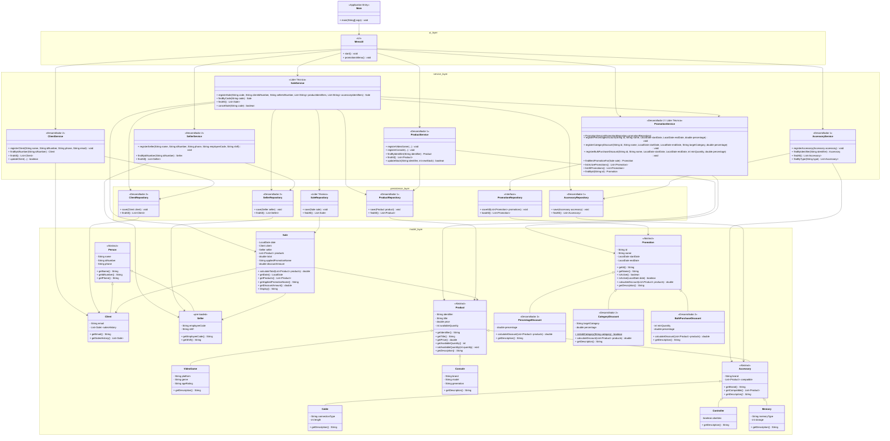

```mermaid
classDiagram
    direction TB
 
    class Main {
        <<Application Entry>>
        + main(String[] args) void
    }
 
    namespace ui_layer {
        class MenuUI {
            <<UI>>
            + start() void
            + promotionsMenu() void
        }
    }
 
    namespace service_layer {
        class SaleService {
            <<Líder Técnico>>
            + registerSale(String code, String clientIdNumber, String sellerIdNumber, List~String~ productIdentifiers, List~String~ accessoryIdentifiers) Sale
            + findByCode(String code) Sale
            + findAll() List~Sale~
            + cancelSale(String code) boolean
        }
        class ProductService {
            <<Desarrollador 1>>
            + registerVideoGame(...) void
            + registerConsole(...) void
            + findByIdentifier(String identifier) Product
            + findAll() List~Product~
            + updateStock(String identifier, int newStock) boolean
        }
        class ClientService {
            <<Desarrollador 2>>
            + registerClient(String name, String idNumber, String phone, String email) void
            + findByIdNumber(String idNumber) Client
            + findAll() List~Client~
            + updateClient(...) boolean
        }
        class SellerService {
            <<Desarrollador 2>>
            + registerSeller(String name, String idNumber, String phone, String employeeCode, String shift) void
            + findByIdNumber(String idNumber) Seller
            + findAll() List~Seller~
        }
        class AccessoryService {
            <<Desarrollador 1>>
            + registerAccessory(Accessory accessory) void
            + findByIdentifier(String identifier) Accessory
            + findAll() List~Accessory~
            + findByType(String type) List~Accessory~
        }
        class PromotionService {
            <<Desarrollador 2 / Líder Técnico>>
            + PromotionService(PromotionRepository promotionRepository)
            + registerPercentageDiscount(String id, String name, LocalDate startDate, LocalDate endDate, double percentage) void
            + registerCategoryDiscount(String id, String name, LocalDate startDate, LocalDate endDate, String targetCategory, double percentage) void
            + registerBulkPurchaseDiscount(String id, String name, LocalDate startDate, LocalDate endDate, int minQuantity, double percentage) void
            + findBestPromotionFor(Sale sale) Promotion
            + listActivePromotions() List~Promotion~
            + listAllPromotions() List~Promotion~
            + findById(String id) Promotion
        }
    }
 
    namespace persistence_layer {
        class SaleRepository {
            <<Líder Técnico>>
            + save(Sale sale) void
            + findAll() List~Sale~
        }
        class ProductRepository {
            <<Desarrollador 1>>
            + save(Product product) void
            + findAll() List~Product~
        }
        class ClientRepository {
            <<Desarrollador 2>>
            + save(Client client) void
            + findAll() List~Client~
        }
        class SellerRepository {
            <<Desarrollador 2>>
            + save(Seller seller) void
            + findAll() List~Seller~
        }
        class AccessoryRepository {
            <<Desarrollador 1>>
            + save(Accessory accessory) void
            + findAll() List~Accessory~
        }
        class PromotionRepository {
            <<Interface>>
            <<Desarrollador 2>>
            + saveAll(List~Promotion~ promotions) void
            + loadAll() List~Promotion~
        }
    }
 
    namespace model_layer {
        class Person {
            <<Abstract>>
            - String name
            - String idNumber
            - String phone
            + getName() String
            + getIdNumber() String
            + getPhone() String
        }
        class Client {
            - String email
            - List~Sale~ salesHistory
            + getEmail() String
            + getSalesHistory() List~Sale~
        }
        class Seller {
            <<pre-loaded>>
            - String employeeCode
            - String shift
            + getEmployeeCode() String
            + getShift() String
        }
        class Product {
            <<Abstract>>
            - String identifier
            - String title
            - double price
            - int availableQuantity
            + getIdentifier() String
            + getTitle() String
            + getPrice() double
            + getAvailableQuantity() int
            + setAvailableQuantity(int quantity) void
            + getDescription()* String
        }
        class VideoGame {
            - String platform
            - String genre
            - String ageRating
            + getDescription() String
        }
        class Console {
            - String brand
            - String model
            - String generation
            + getDescription() String
        }
        class Accessory {
            <<Abstract>>
            - String brand
            - List~Product~ compatible
            + getBrand() String
            + getCompatible() List~Product~
            + getDescription()* String
        }
        class Cable {
            - String connectionType
            - int length
            + getDescription() String
        }
        class Controller {
            - boolean alambric
            + getDescription() String
        }
        class Memory {
            - String memoryType
            - int storage
            + getDescription() String
        }
        class Sale {
            - LocalDate date
            - Client client
            - Seller seller
            - List~Product~ products
            - double total
            - String appliedPromotionName
            - double discountAmount
            + calculateTotal(List~Product~ products) double
            + getDate() LocalDate
            + getProducts() List~Product~
            + getAppliedPromotionName() String
            + getDiscountAmount() double
            + Display() String
        }
        class Promotion {
            <<Abstract>>
            <<Desarrollador 2>>
            - String id
            - String name
            - LocalDate startDate
            - LocalDate endDate
            + getId() String
            + getName() String
            + isActive() boolean
            + isActive(LocalDate date) boolean
            + calculateDiscount(List~Product~ products)* double
            + getDescription()* String
        }
        class PercentageDiscount {
            <<Desarrollador 2>>
            - double percentage
            + calculateDiscount(List~Product~ products) double
            + getDescription() String
        }
        class CategoryDiscount {
            <<Desarrollador 2>>
            - String targetCategory
            - double percentage
            + isValidCategory(String category)$ boolean
            + calculateDiscount(List~Product~ products) double
            + getDescription() String
        }
        class BulkPurchaseDiscount {
            <<Desarrollador 2>>
            - int minQuantity
            - double percentage
            + calculateDiscount(List~Product~ products) double
            + getDescription() String
        }
    }
 
    %% Dependencias de entrada y UI
    Main --> MenuUI
 
    %% Dependencias UI -> Service
    MenuUI --> SaleService
    MenuUI --> ProductService
    MenuUI --> ClientService
    MenuUI --> SellerService
    MenuUI --> AccessoryService
    MenuUI --> PromotionService
 
    %% Dependencias Service -> Persistence
    SaleService --> SaleRepository
    SaleService --> ClientRepository
    SaleService --> SellerRepository
    SaleService --> ProductRepository
    SaleService --> AccessoryRepository
    SaleService --> PromotionService
    ProductService --> ProductRepository
    ClientService --> ClientRepository
    SellerService --> SellerRepository
    AccessoryService --> AccessoryRepository
    PromotionService --> PromotionRepository
 
    %% Dependencias de Service hacia Model (relaciones de uso)
    SaleService --> Sale
    ProductService --> Product
    ClientService --> Client
    SellerService --> Seller
    AccessoryService --> Accessory
    PromotionService --> Promotion
 
    %% Dependencias de Persistence hacia Model
    SaleRepository --> Sale
    ProductRepository --> Product
    ClientRepository --> Client
    SellerRepository --> Seller
    AccessoryRepository --> Accessory
    PromotionRepository --> Promotion
 
    %% Relaciones de Herencia (Triángulos)
    Person <|-- Client
    Person <|-- Seller
    Product <|-- VideoGame
    Product <|-- Console
    Product <|-- Accessory
    Accessory <|-- Cable
    Accessory <|-- Controller
    Accessory <|-- Memory
    Promotion <|-- PercentageDiscount
    Promotion <|-- CategoryDiscount
    Promotion <|-- BulkPurchaseDiscount
 
    %% Relaciones de Asociación de la Venta
    Sale --> Client
    Sale --> Seller
    Sale --> Product
```
 