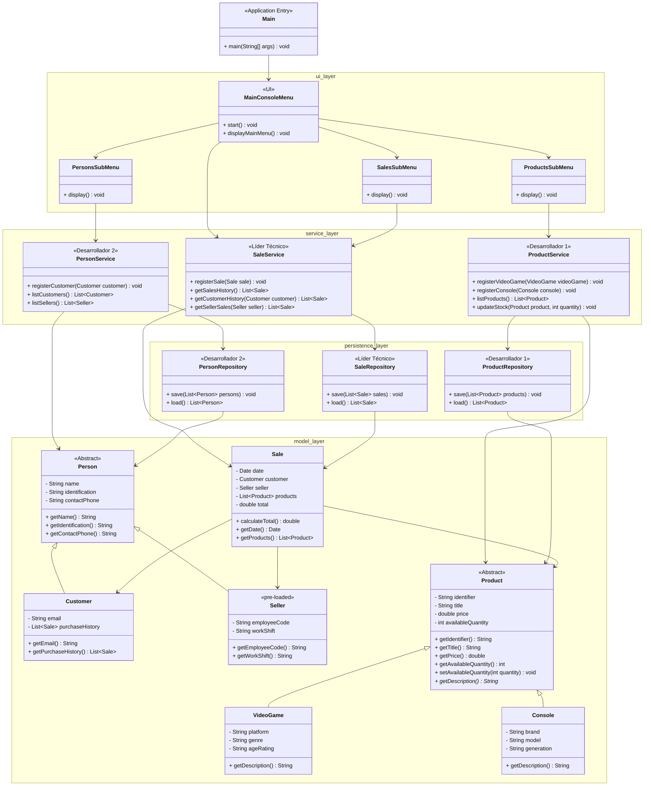

```mermaid
classDiagram
    direction TB

    class Main {
        <<Application Entry>>
        + main(String[] args) void
    }

    namespace ui_layer {
        class MainConsoleMenu {
            <<UI>>
            + start() void
            + displayMainMenu() void
        }
        class ProductsSubMenu {
            + display() void
        }
        class PersonsSubMenu {
            + display() void
        }
        class SalesSubMenu {
            + display() void
        }
    }

    namespace service_layer {
        class SaleService {
            <<Líder Técnico>>
            + registerSale(Sale sale) void
            + getSalesHistory() List~Sale~
            + getCustomerHistory(Customer customer) List~Sale~
            + getSellerSales(Seller seller) List~Sale~
        }
        class ProductService {
            <<Desarrollador 1>>
            + registerVideoGame(VideoGame videoGame) void
            + registerConsole(Console console) void
            + listProducts() List~Product~
            + updateStock(Product product, int quantity) void
        }
        class PersonService {
            <<Desarrollador 2>>
            + registerCustomer(Customer customer) void
            + listCustomers() List~Customer~
            + listSellers() List~Seller~
        }
    }

    namespace persistence_layer {
        class SaleRepository {
            <<Líder Técnico>>
            + save(List~Sale~ sales) void
            + load() List~Sale~
        }
        class ProductRepository {
            <<Desarrollador 1>>
            + save(List~Product~ products) void
            + load() List~Product~
        }
        class PersonRepository {
            <<Desarrollador 2>>
            + save(List~Person~ persons) void
            + load() List~Person~
        }
    }

    namespace model_layer {
        class Person {
            <<Abstract>>
            - String name
            - String identification
            - String contactPhone
            + getName() String
            + getIdentification() String
            + getContactPhone() String
        }
        class Customer {
            - String email
            - List~Sale~ purchaseHistory
            + getEmail() String
            + getPurchaseHistory() List~Sale~
        }
        class Seller {
            <<pre-loaded>>
            - String employeeCode
            - String workShift
            + getEmployeeCode() String
            + getWorkShift() String
        }
        class Product {
            <<Abstract>>
            - String identifier
            - String title
            - double price
            - int availableQuantity
            + getIdentifier() String
            + getTitle() String
            + getPrice() double
            + getAvailableQuantity() int
            + setAvailableQuantity(int quantity) void
            + getDescription()* String
        }
        class VideoGame {
            - String platform
            - String genre
            - String ageRating
            + getDescription() String
        }
        class Console {
            - String brand
            - String model
            - String generation
            + getDescription() String
        }
        class Sale {
            - Date date
            - Customer customer
            - Seller seller
            - List~Product~ products
            - double total
            + calculateTotal() double
            + getDate() Date
            + getProducts() List~Product~
        }
    }

    %% Dependencias de entrada y UI
    Main --> MainConsoleMenu
    MainConsoleMenu --> ProductsSubMenu
    MainConsoleMenu --> PersonsSubMenu
    MainConsoleMenu --> SalesSubMenu

    %% Dependencias UI -> Service
    MainConsoleMenu --> SaleService
    ProductsSubMenu --> ProductService
    PersonsSubMenu --> PersonService
    SalesSubMenu --> SaleService

    %% Dependencias Service -> Persistence
    SaleService --> SaleRepository
    ProductService --> ProductRepository
    PersonService --> PersonRepository

    %% Dependencias de Service hacia Model (relaciones de uso)
    SaleService --> Sale
    ProductService --> Product
    PersonService --> Person

    %% Dependencias de Persistence hacia Model
    SaleRepository --> Sale
    ProductRepository --> Product
    PersonRepository --> Person

    %% Relaciones de Herencia (Triángulos)
    Person <|-- Customer
    Person <|-- Seller
    Product <|-- VideoGame
    Product <|-- Console

    %% Relaciones de Asociación de la Venta
    Sale --> Customer
    Sale --> Seller
    Sale --> Product
```
