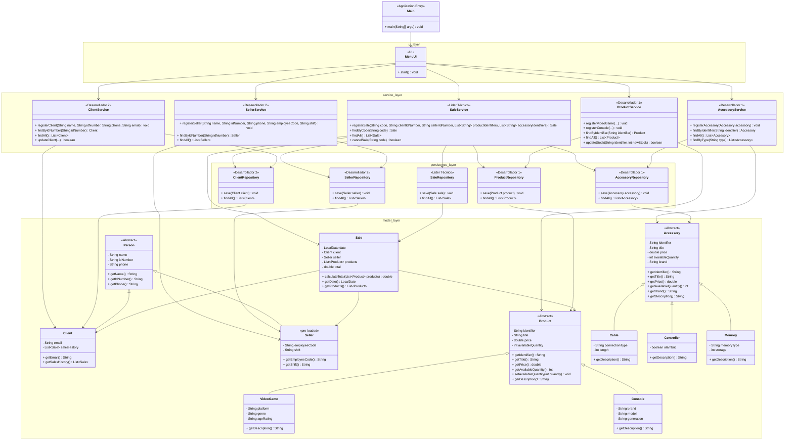

```mermaid
classDiagram
    direction TB

    class Main {
        <<Application Entry>>
        + main(String[] args) void
    }

    namespace ui_layer {
        class MenuUI {
            <<UI>>
            + start() void
        }
    }

    namespace service_layer {
        class SaleService {
            <<Líder Técnico>>
            + registerSale(String code, String clientIdNumber, String sellerIdNumber, List~String~ productIdentifiers, List~String~ accessoryIdentifiers) Sale
            + findByCode(String code) Sale
            + findAll() List~Sale~
            + cancelSale(String code) boolean
        }
        class ProductService {
            <<Desarrollador 1>>
            + registerVideoGame(...) void
            + registerConsole(...) void
            + findByIdentifier(String identifier) Product
            + findAll() List~Product~
            + updateStock(String identifier, int newStock) boolean
        }
        class ClientService {
            <<Desarrollador 2>>
            + registerClient(String name, String idNumber, String phone, String email) void
            + findByIdNumber(String idNumber) Client
            + findAll() List~Client~
            + updateClient(...) boolean
        }
        class SellerService {
            <<Desarrollador 2>>
            + registerSeller(String name, String idNumber, String phone, String employeeCode, String shift) void
            + findByIdNumber(String idNumber) Seller
            + findAll() List~Seller~
        }
        class AccessoryService {
            <<Desarrollador 1>>
            + registerAccessory(Accessory accessory) void
            + findByIdentifier(String identifier) Accessory
            + findAll() List~Accessory~
            + findByType(String type) List~Accessory~
        }
    }

    namespace persistence_layer {
        class SaleRepository {
            <<Líder Técnico>>
            + save(Sale sale) void
            + findAll() List~Sale~
        }
        class ProductRepository {
            <<Desarrollador 1>>
            + save(Product product) void
            + findAll() List~Product~
        }
        class ClientRepository {
            <<Desarrollador 2>>
            + save(Client client) void
            + findAll() List~Client~
        }
        class SellerRepository {
            <<Desarrollador 2>>
            + save(Seller seller) void
            + findAll() List~Seller~
        }
        class AccessoryRepository {
            <<Desarrollador 1>>
            + save(Accessory accessory) void
            + findAll() List~Accessory~
        }
    }

    namespace model_layer {
        class Person {
            <<Abstract>>
            - String name
            - String idNumber
            - String phone
            + getName() String
            + getIdNumber() String
            + getPhone() String
        }
        class Client {
            - String email
            - List~Sale~ salesHistory
            + getEmail() String
            + getSalesHistory() List~Sale~
        }
        class Seller {
            <<pre-loaded>>
            - String employeeCode
            - String shift
            + getEmployeeCode() String
            + getShift() String
        }
        class Product {
            <<Abstract>>
            - String identifier
            - String title
            - double price
            - int availableQuantity
            + getIdentifier() String
            + getTitle() String
            + getPrice() double
            + getAvailableQuantity() int
            + setAvailableQuantity(int quantity) void
            + getDescription()* String
        }
        class VideoGame {
            - String platform
            - String genre
            - String ageRating
            + getDescription() String
        }
        class Console {
            - String brand
            - String model
            - String generation
            + getDescription() String
        }
        class Accessory {
            <<Abstract>>
            - String identifier
            - String title
            - double price
            - int availableQuantity
            - String brand
            + getIdentifier() String
            + getTitle() String
            + getPrice() double
            + getAvailableQuantity() int
            + getBrand() String
            + getDescription()* String
        }
        class Cable {
            - String connectionType
            - int length
            + getDescription() String
        }
        class Controller {
            - boolean alambric
            + getDescription() String
        }
        class Memory {
            - String memoryType
            - int storage
            + getDescription() String
        }
        class Sale {
            - LocalDate date
            - Client client
            - Seller seller
            - List~Product~ products
            - double total
            + calculateTotal(List~Product~ products) double
            + getDate() LocalDate
            + getProducts() List~Product~
        }
    }

    %% Dependencias de entrada y UI
    Main --> MenuUI

    %% Dependencias UI -> Service
    MenuUI --> SaleService
    MenuUI --> ProductService
    MenuUI --> ClientService
    MenuUI --> SellerService
    MenuUI --> AccessoryService

    %% Dependencias Service -> Persistence
    SaleService --> SaleRepository
    SaleService --> ClientRepository
    SaleService --> SellerRepository
    SaleService --> ProductRepository
    SaleService --> AccessoryRepository
    ProductService --> ProductRepository
    ClientService --> ClientRepository
    SellerService --> SellerRepository
    AccessoryService --> AccessoryRepository

    %% Dependencias de Service hacia Model (relaciones de uso)
    SaleService --> Sale
    ProductService --> Product
    ClientService --> Client
    SellerService --> Seller
    AccessoryService --> Accessory

    %% Dependencias de Persistence hacia Model
    SaleRepository --> Sale
    ProductRepository --> Product
    ClientRepository --> Client
    SellerRepository --> Seller
    AccessoryRepository --> Accessory

    %% Relaciones de Herencia (Triángulos)
    Person <|-- Client
    Person <|-- Seller
    Product <|-- VideoGame
    Product <|-- Console
    Accessory <|-- Cable
    Accessory <|-- Controller
    Accessory <|-- Memory

    %% Relaciones de Asociación de la Venta
    Sale --> Client
    Sale --> Seller
    Sale --> Product
```
