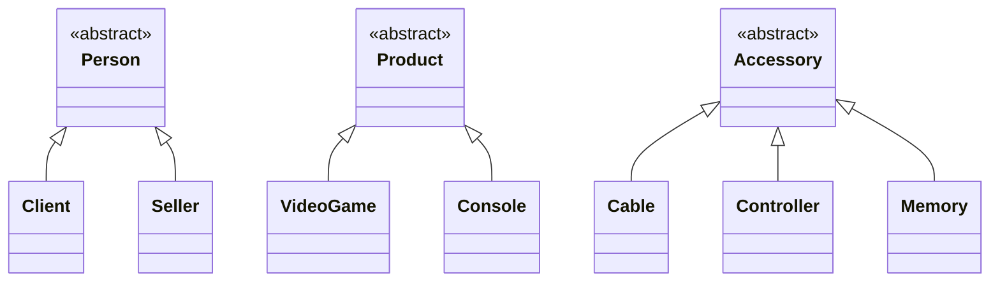

```mermaid
classDiagram
    direction TB

    %% Person Hierarchy
    class Person {
        <<abstract>>
    }
    class Client {
    }
    class Seller {
    }

    Person <|-- Client
    Person <|-- Seller

    %% Product Hierarchy
    class Product {
        <<abstract>>
    }
    class VideoGame {
    }
    class Console {
    }

    Product <|-- VideoGame
    Product <|-- Console

    %% Accessory Hierarchy
    class Accessory {
        <<abstract>>
    }
    class Cable {
    }
    class Controller {
    }
    class Memory {
    }

    Accessory <|-- Cable
    Accessory <|-- Controller
    Accessory <|-- Memory
```
