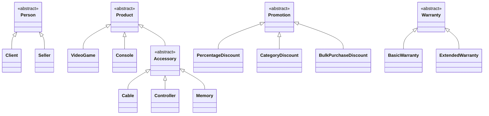

```mermaid
classDiagram
    direction TB

    %% Person Hierarchy
    class Person {
        <<abstract>>
    }
    class Client {
    }
    class Seller {
    }

    Person <|-- Client
    Person <|-- Seller

    %% Product Hierarchy
    class Product {
        <<abstract>>
    }
    class VideoGame {
    }
    class Console {
    }
    class Accessory {
        <<abstract>>
    }
    class Cable {
    }
    class Controller {
    }
    class Memory {
    }

    Product <|-- VideoGame
    Product <|-- Console
    Product <|-- Accessory
    Accessory <|-- Cable
    Accessory <|-- Controller
    Accessory <|-- Memory

    %% Promotion Hierarchy
    class Promotion {
        <<abstract>>
    }
    class PercentageDiscount {
    }
    class CategoryDiscount {
    }
    class BulkPurchaseDiscount {
    }

    Promotion <|-- PercentageDiscount
    Promotion <|-- CategoryDiscount
    Promotion <|-- BulkPurchaseDiscount

    %% Warranty Hierarchy
    class Warranty {
        <<abstract>>
    }
    class BasicWarranty {
    }
    class ExtendedWarranty {
    }

    Warranty <|-- BasicWarranty
    Warranty <|-- ExtendedWarranty

    %% Nota: Return (model) es una clase nueva de la funcionalidad de
    %% devoluciones, pero no participa de ninguna jerarquía de herencia:
    %% es una clase concreta e independiente que solo se asocia con
    %% Sale y Product (ver class-diagram.md y layers-diagram.md).
```