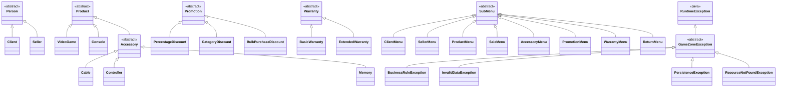

```mermaid
classDiagram
    direction TB

    %% Person Hierarchy
    class Person {
        <<abstract>>
    }
    class Client {
    }
    class Seller {
    }

    Person <|-- Client
    Person <|-- Seller

    %% Product Hierarchy
    class Product {
        <<abstract>>
    }
    class VideoGame {
    }
    class Console {
    }
    class Accessory {
        <<abstract>>
    }
    class Cable {
    }
    class Controller {
    }
    class Memory {
    }

    Product <|-- VideoGame
    Product <|-- Console
    Product <|-- Accessory
    Accessory <|-- Cable
    Accessory <|-- Controller
    Accessory <|-- Memory

    %% Promotion Hierarchy
    class Promotion {
        <<abstract>>
    }
    class PercentageDiscount {
    }
    class CategoryDiscount {
    }
    class BulkPurchaseDiscount {
    }

    Promotion <|-- PercentageDiscount
    Promotion <|-- CategoryDiscount
    Promotion <|-- BulkPurchaseDiscount

    %% Warranty Hierarchy
    class Warranty {
        <<abstract>>
    }
    class BasicWarranty {
    }
    class ExtendedWarranty {
    }

    Warranty <|-- BasicWarranty
    Warranty <|-- ExtendedWarranty

    %% UI Hierarchy
    class SubMenu {
        <<abstract>>
    }
    class ClientMenu {
    }
    class SellerMenu {
    }
    class ProductMenu {
    }
    class SaleMenu {
    }
    class AccessoryMenu {
    }
    class PromotionMenu {
    }
    class WarrantyMenu {
    }
    class ReturnMenu {
    }

    SubMenu <|-- ClientMenu
    SubMenu <|-- SellerMenu
    SubMenu <|-- ProductMenu
    SubMenu <|-- SaleMenu
    SubMenu <|-- AccessoryMenu
    SubMenu <|-- PromotionMenu
    SubMenu <|-- WarrantyMenu
    SubMenu <|-- ReturnMenu

    %% Exception Hierarchy
    class RuntimeException {
        <<Java>>
    }
    class GameZoneException {
        <<abstract>>
    }
    class BusinessRuleException {
    }
    class InvalidDataException {
    }
    class PersistenceException {
    }
    class ResourceNotFoundException {
    }

    RuntimeException <|-- GameZoneException
    GameZoneException <|-- BusinessRuleException
    GameZoneException <|-- InvalidDataException
    GameZoneException <|-- PersistenceException
    GameZoneException <|-- ResourceNotFoundException

    %% Nota: Return (model) es una clase nueva de la funcionalidad de
    %% devoluciones, pero no participa de ninguna jerarquía de herencia:
    %% es una clase concreta e independiente que solo se asocia con
    %% Sale y Product (ver class-diagram.md y layers-diagram.md).
    %%
    %% Nota (Requerimiento 7, refactor GRASP): Product declara
    %% requiresBasicWarranty() (por defecto false) y Console lo sobrescribe
    %% (true). No hay clases ni herencias nuevas en el modelo: es solo un
    %% método polimórfico que reemplaza el instanceof Console de SaleService.
    %% Las jerarquías nuevas son de interfaz (SubMenu y sus 8 submenús, que
    %% parten MenuUI) y de excepciones (GameZoneException y sus 4 subclases).
    %% Las clases de validation (PersonValidator, ProductValidator,
    %% SaleValidator) son utilitarias estáticas y no participan de herencia.
    %%
    %% Nota (Requerimiento 5, ajuste A1): CategoryDiscount ahora también
    %% acepta "ACCESSORY" como categoría objetivo, además de "VIDEOGAME" y
    %% "CONSOLE". Esto no crea ninguna clase ni relación de herencia nueva:
    %% Accessory ya es subclase de Product, así que basta con que
    %% CategoryDiscount reconozca las instancias de Accessory (y por lo
    %% tanto también de Cable, Controller y Memory) al calcular el
    %% descuento.
```