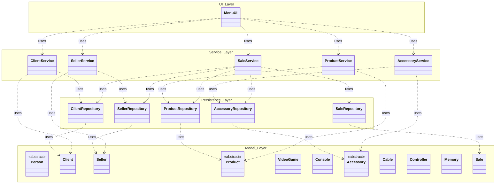

```mermaid
classDiagram
    direction TB

    namespace UI_Layer {
        class MenuUI {
        }
    }

    namespace Service_Layer {
        class ProductService {
        }
        class ClientService {
        }
        class SellerService {
        }
        class AccessoryService {
        }
        class SaleService {
        }
    }

    namespace Persistence_Layer {
        class ProductRepository {
        }
        class ClientRepository {
        }
        class SellerRepository {
        }
        class AccessoryRepository {
        }
        class SaleRepository {
        }
    }

    namespace Model_Layer {
        class Person {
            <<abstract>>
        }
        class Client {
        }
        class Seller {
        }
        class Product {
            <<abstract>>
        }
        class VideoGame {
        }
        class Console {
        }
        class Accessory {
            <<abstract>>
        }
        class Cable {
        }
        class Controller {
        }
        class Memory {
        }
        class Sale {
        }
    }

    %% Dependencies between layers
    MenuUI ..> ProductService : uses
    MenuUI ..> ClientService : uses
    MenuUI ..> SellerService : uses
    MenuUI ..> AccessoryService : uses
    MenuUI ..> SaleService : uses

    SaleService ..> ClientRepository : uses
    SaleService ..> SellerRepository : uses
    SaleService ..> ProductRepository : uses
    SaleService ..> AccessoryRepository : uses
    SaleService ..> SaleRepository : uses

    ProductService ..> ProductRepository : uses
    ProductService ..> Product : uses

    ClientService ..> ClientRepository : uses
    ClientService ..> Client : uses

    SellerService ..> SellerRepository : uses
    SellerService ..> Seller : uses

    AccessoryService ..> AccessoryRepository : uses
    AccessoryService ..> Accessory : uses

    SaleRepository ..> Sale : uses
    ProductRepository ..> Product : uses
    ClientRepository ..> Client : uses
    SellerRepository ..> Seller : uses
    AccessoryRepository ..> Accessory : uses
```
