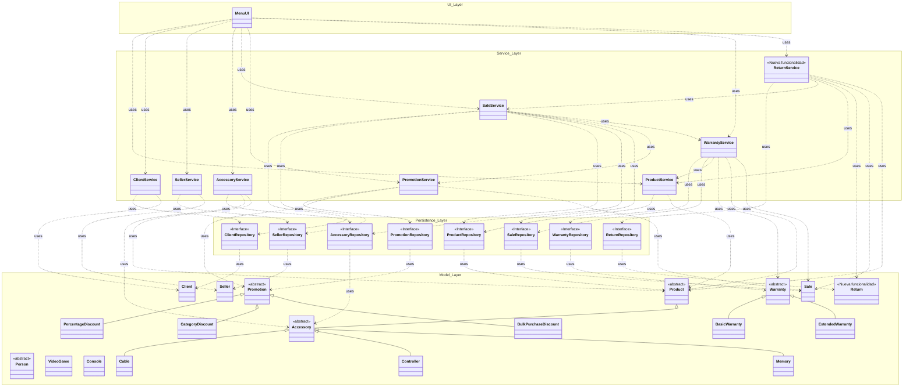

```mermaid
classDiagram
    direction TB

    namespace UI_Layer {
        class MenuUI {
        }
    }

    namespace Service_Layer {
        class ProductService {
        }
        class ClientService {
        }
        class SellerService {
        }
        class AccessoryService {
        }
        class SaleService {
        }
        class PromotionService {
        }
        class WarrantyService {
        }
        class ReturnService {
            <<Nueva funcionalidad>>
        }
    }

    namespace Persistence_Layer {
        class ProductRepository {
            <<Interface>>
        }
        class ClientRepository {
            <<Interface>>
        }
        class SellerRepository {
            <<Interface>>
        }
        class AccessoryRepository {
            <<Interface>>
        }
        class SaleRepository {
            <<Interface>>
        }
        class PromotionRepository {
            <<Interface>>
        }
        class WarrantyRepository {
            <<Interface>>
        }
        class ReturnRepository {
            <<Interface>>
            <<Nueva funcionalidad>>
        }
    }

    namespace Model_Layer {
        class Person {
            <<abstract>>
        }
        class Client {
        }
        class Seller {
        }
        class Product {
            <<abstract>>
        }
        class VideoGame {
        }
        class Console {
        }
        class Accessory {
            <<abstract>>
        }
        class Cable {
        }
        class Controller {
        }
        class Memory {
        }
        class Sale {
        }
        class Return {
            <<Nueva funcionalidad>>
        }
        class Promotion {
            <<abstract>>
        }
        class PercentageDiscount {
        }
        class CategoryDiscount {
        }
        class BulkPurchaseDiscount {
        }
        class Warranty {
            <<abstract>>
        }
        class BasicWarranty {
        }
        class ExtendedWarranty {
        }
    }

    %% Nota: todas las clases de la capa de servicios viven en el paquete
    %% "services" (incluida ProductService); el desajuste de paquete
    %% "service"/"services" documentado en versiones anteriores ya no
    %% existe en el código actual.

    %% Dependencies between layers
    MenuUI ..> ProductService : uses
    MenuUI ..> ClientService : uses
    MenuUI ..> SellerService : uses
    MenuUI ..> AccessoryService : uses
    MenuUI ..> SaleService : uses
    MenuUI ..> PromotionService : uses
    MenuUI ..> WarrantyService : uses
    MenuUI ..> ReturnService : uses

    SaleService ..> ClientRepository : uses
    SaleService ..> SellerRepository : uses
    SaleService ..> ProductRepository : uses
    SaleService ..> AccessoryRepository : uses
    SaleService ..> SaleRepository : uses
    SaleService ..> PromotionService : uses
    SaleService ..> WarrantyService : uses

    ProductService ..> ProductRepository : uses
    ProductService ..> Product : uses

    ClientService ..> ClientRepository : uses
    ClientService ..> Client : uses

    SellerService ..> SellerRepository : uses
    SellerService ..> Seller : uses

    AccessoryService ..> AccessoryRepository : uses
    AccessoryService ..> Accessory : uses
    AccessoryService ..> Product : uses

    PromotionService ..> PromotionRepository : uses
    PromotionService ..> Promotion : uses
    PromotionService ..> Sale : uses

    WarrantyService ..> WarrantyRepository : uses
    WarrantyService ..> SaleRepository : uses
    WarrantyService ..> ProductService : uses
    WarrantyService ..> Warranty : uses
    WarrantyService ..> Product : uses
    WarrantyService ..> Sale : uses

    ReturnService ..> ReturnRepository : uses
    ReturnService ..> SaleService : uses
    ReturnService ..> ProductService : uses
    ReturnService ..> Return : uses
    ReturnService ..> Sale : uses
    ReturnService ..> Product : uses

    SaleRepository ..> Sale : uses
    ProductRepository ..> Product : uses
    ClientRepository ..> Client : uses
    SellerRepository ..> Seller : uses
    AccessoryRepository ..> Accessory : uses
    PromotionRepository ..> Promotion : uses
    WarrantyRepository ..> Warranty : uses
    ReturnRepository ..> Return : uses

    Product <|-- Accessory
    Accessory <|-- Cable
    Accessory <|-- Controller
    Accessory <|-- Memory
    Promotion <|-- PercentageDiscount
    Promotion <|-- CategoryDiscount
    Promotion <|-- BulkPurchaseDiscount
    Warranty <|-- BasicWarranty
    Warranty <|-- ExtendedWarranty
```